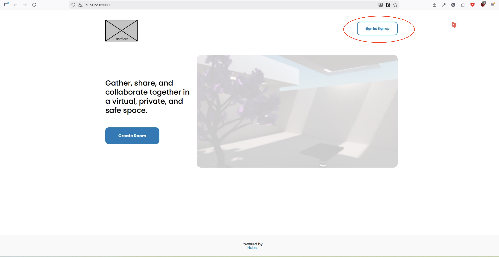
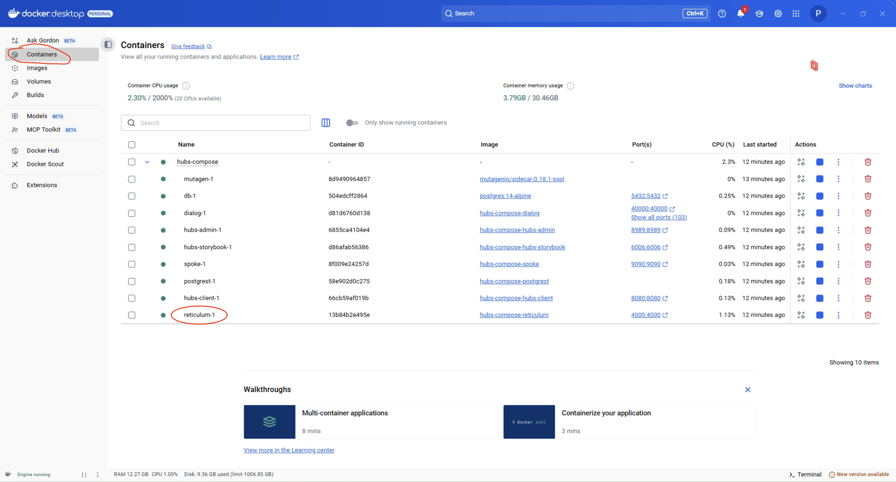
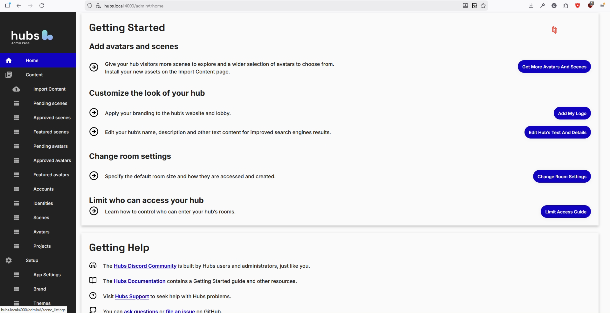
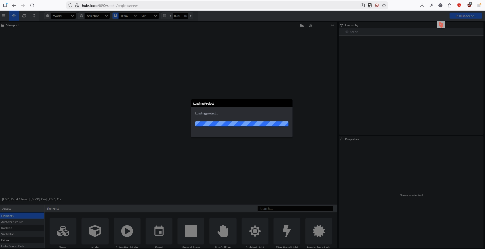
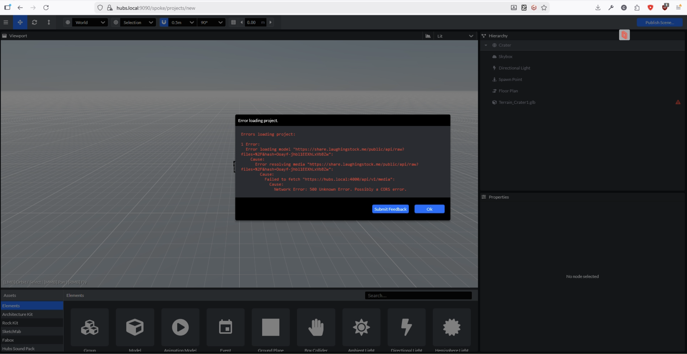
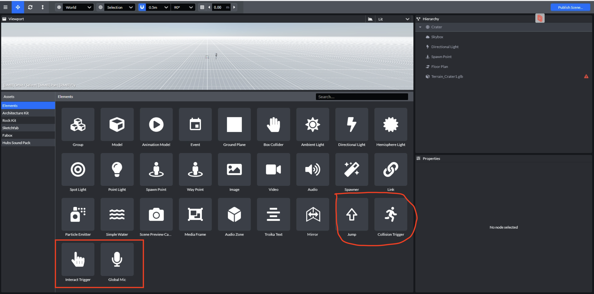
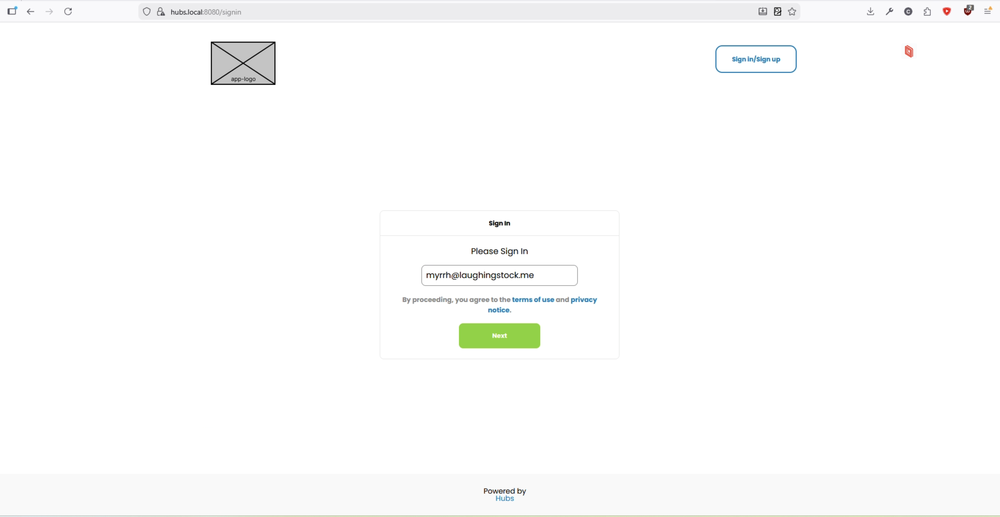
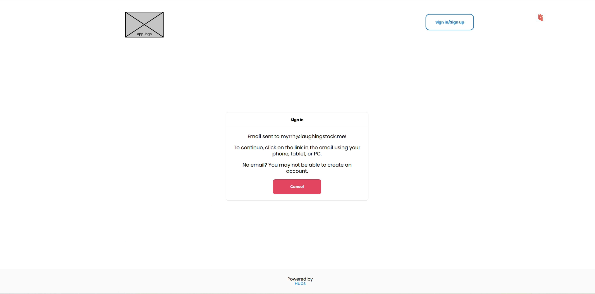

# Hubs Compose (九州大学)　日本語版

# 設置条件

- Docker
- Docker Compose
- Docker Desktop
- WSL

### （手動設置の場合）

- Mutagen
- Mutagen Compose
- Python

# 概説

`hubs-compose`は`hubs`のサーバー環境を配置・管理するためのソフトです。その目的では、様々なフロントエンドとバックエンドソフトを利用する必要があります：

- **Hubs (Client)**: プレイヤー向けフロントエンド
- **Hubs (Admin):** 管理人・開発者向けフロントエンド
- **Spoke**: コンテンツの制作ツール
- **Reticulum:** サーバーのバックエンド
- **Dialog**: 音声チャットのバックエンド
- **Postgres:** バックエンドのデータベース
- **Storybook**: UI 開発の整理・開発ソフト
- **Mutagen**: ファイル・システムの同期化するソフト

その中で、注意すべきソフトは**Hubs**・**Spoke**・**Reticulum**です。

**Hubs**と**Spoke**は JavaScript（React 使用）で書かれて、その一方で**reticulum**は Erlang（Elixir 使用）のソフトです。

その全てを同時に実行するためには、幾つかのステップを必要とします。
その目的で、元の`hubs-compose`コードベースをサーバー配置と管理の使いやすさに改良しました。

## Option 1: WSL のイメージ

hubs-compose`は組み立て済みの WSL イメージで実行できます。Powershell でインポートするコマンド：

```Powershell
wsl.exe --import UbuntuHubsClean C:\Users\ICER\WSL\instances\HubsTestClean C:\Users\ICER\WSL\images\resolute-wsl-amd64.wsl --version 2
```

コマンドで、`UbuntuHubsClean`という WSL2 のイメージを`C:\Users\ICER\WSL\images\HubsClean.tar`のイメージから`C:\Users\ICER\WSL\instances\HubsClean`に記録されます。

### WSL 起動

インポートすると、起動できます。

```Powershell
wsl -d UbuntuHubsClean -u icer --cd ~
```

コマンドで`UbuntuHubsClean`というイメージを起動して、`icer`というユーザーのホームディレクトリに移動されます。

### `hubs-compose`のディレクトリに移動

```bash
cd ~/hubs-compose
```

### サーバー起動

```bash
./bin/up
```

### `https://hubs.local:4000/`に移動

サーバー起動が終わった後で、ブラウザで`https://hubs.local:4000/`に行って、hubs がアクセスできます。

#### 接続問題の場合は

接続出来い場合では、Docker コンテナーが完全に起動しているかどうか確認してください。起動のエラーが出た可能性があります。

コンテナーの全てがうまく実行されているなら、パソコン（特に wsl）の`hosts`ファイルをアップディートする必要の可能性もあります。OS によって手順が違いますが、Ubuntu の場合は`/etc/hosts`というファイルをオープンして、次の行列を付け加えてください。

```
  127.0.0.1   hubs.local
  127.0.0.1   hubs-proxy.local
```

これで、ローカル・ネットワークで特別な hubs の URL にアクセスできます。

接続する時にセキュリティ警告があれば：


ブラウザによって例外を追加してください。


### 管理アカウントにログイン

右上のサインアップボタンを押して、メールアドレスを入力してください。



管理アカウント・ネームは`icer@m.kyushu-u.ac.jp`です。


入力後は、下の画像のように見えるはずです。


### Docker Desktop に移動、`reticulum`のコンテナーにメール確認 URL を探す

開発中のサーバーですので、確認メールは送りませんが、サーバーのログをチェックすると、確認 URL にアクセスできます。

Docker Desktop をオープンして、「Containers」というボタンを押して、`reticulum`をクリックしてください。



それで、`reticulum`のログが見えるはずです。


ログの末尾ぐらいには、長い URL があるはずです。URL をクリックしたら、アカウントログインを確認できます。普通のサーバーで、それはユーザに送られたメールコンテンツです。

### ページをリフレッシュ

Web ページをリフレッシュすると、**Admin**のボタンが画面の左上に見えるはずです。


ボタンを押すと、管理人の設定ページに移動して、グローバル設定を編集できます。



### `https://hubs.local:4000/spoke`で Spoke をアクセス

`https://hubs.local:4000/spoke`の URL で Spoke にもアクセスできます。hubs の左上の「Scene Editor」で書かれたボタンを押すと、spoke に移動されます。


#### CORS 問題

新しいプロジェクトをロードしてみると、長い時間をかかるでしょう。そうすると、以下の写真のようなイメージを見るはずです。



後でエラーも現れます。



現在の CORS 設定のせいでエラーが出ました。サーバーは外部ネットワークから 3D モデル等をロードしようとしたが、今の所できません。

外部ネットワークに接続する機能はまだ実装していませんが、まもなく実装する予定です。　それでエラーはすぐ消えます。

一応、OK ボタンを押すと、エラーが消えます。

新しい機能が含まれたことも確認できます。



さらに深くテスト・開発は必要ですが、現在のところ｀ Global Mic`の機能性が確認されました。

それ以外の機能は普通に使用できるはずです。

### シーンを発行

普通の方法でシーンを Hubs に発行できます。


## サーバーの起動・停止

サーバーは`bin/down`スクリプトで停止が出来ます。一方で、`bin/up`スクリプトで起動が出来ます。

それに、サーバーの全てを一から作り直したいなら、`bin/reset`スクリプトでコンテイナーを全て消して、再び作ります。

## Option 2: 手動設置

次の手順にご注意ください。

### ユーザーを Docker グループに追加

```bash
sudo adduser $USER docker
sudo chown root:docker /var/run/docker.sock
sudo chmod g+w /var/run/docker.sock
```

### コードベースをクローン、`hubs-compose`のディレクトリに移動

[GitHub Repo](https://github.com/MeirArani/hubs-compose)

```bash
git clone git@github.com:MeirArani/hubs-compose.git
cd hubs-compose
```

### 環境を配置： `bin/init`を実行、

```bash
./bin/init
```

このコマンドでは、`python`と`node`の仮想環境(Virtual Environment)を配置して、`hubs-compose`の Docker イメージのビルド手続きを開始します。

**注意:** 初めてサーバー配置する時、`init`実行を必要とします。後で実行したら Docker イメージがもう一回リビルドされています。

### サーバーを起動: `bin/up`を実行

```bash
./bin/up
```

`up`では Docker のコンテナが配置されます。つまり、サーバーのパワーオンとして機能します。

### `https://hubs.local:4000/`に移動

サーバー起動が終わった後で、ブラウザで`https://hubs.local:4000/`に行って、hubs がアクセスできます。

#### 接続問題の場合は

接続出来い場合では、Docker コンテナーが完全に起動しているかどうか確認してください。起動のエラーが出た可能性があります。

コンテナーの全てがうまく実行されているなら、パソコン（特に wsl）の`hosts`ファイルをアップディートする必要の可能性もあります。OS によって手順が違いますが、Ubuntu の場合は`/etc/hosts`というファイルをオープンして、次の行列を付け加えてください。

```
  127.0.0.1   hubs.local
  127.0.0.1   hubs-proxy.local
```

これで、ローカル・ネットワークで特別な hubs の URL にアクセスできます。

接続する時にセキュリティ警告があれば：


ブラウザによって例外を追加してください。


### アカウント制作

右上のサインアップボタンを押して、メールアドレスを入力してください。


サーバーが開発中ですので、偽のメールアドレスでも使えます。
現在、メールを送らないので、アドレスの有効性が確認されません。



入力後は、下の画像のように見えるはずです。



### Docker Desktop に移動、`reticulum`のコンテナーにメール確認 URL を探す

開発中のサーバーですので、確認メールは送りませんが、サーバーのログをチェックすると、確認 URL にアクセスできます。

Docker Desktop をオープンして、「Containers」というボタンを押して、`reticulum`をクリックしてください。


それで、`reticulum`のログが見えるはずです。


ログの末尾ぐらいには、長い URL があるはずです。URL をクリックしたら、アカウントを確認できます。普通のサーバーで、それはユーザに送られたメールコンテンツです。

### アカウント確認

数秒後、アカウント確認が終わります。

ログイン状態は画面の右上に表示されます。


### アカウントを昇格、ルーム権限を許可

それで、確認されたアカウントを管理人（`admin`)というレベルに昇格します。

wsl のコマンドラインに戻って、以下のコマンドを実行してください。

#### IEX コンソールを起動

まず、`hubs-compose`のディレクトリーにいることを確認して、以下のコマンドを実行してください。

```bash
services/reticulum/bin/iex -S mix
```

IEX のコンソールでは、`reticulum`(つまり、サーバーのバックエンド)が操作できます。

#### アカウントを昇格

それで、IEX コンソールの中では以下のコマンドを実行してください。

```
Ret.Account |> Ret.Repo.all() |> Enum.at(0) |> Ecto.Changeset.change(is_admin: true) |> Ret.Repo.update!()
```

このコマンドでは最初に確認されたアカウントを探して、管理の権限を与えます。

#### ルーム権限を有効にする

hubs のデフォルト設定は厳しいが、コマンドで緩められます。まだ IEX コンソールの中で以上のコマンドを実行してください。

```bash
Ret.AppConfig.set_config_value("features|permissive_rooms", true)
```

### IEX コンソールを修了

`CTRL+C`のショートカットで IEX コンソールを修了できますが、一回入力すると、入力確認のメッセージが現れます。

```bash
iex(2)>
BREAK: (a)bort (A)bort with dump (c)ontinue (p)roc info (i)nfo
       (l)oaded (v)ersion (k)ill (D)b-tables (d)istribution
```

それで、もう一回｀ CTRL+C`を入力すると、修了します。

### ページをリフレッシュ

Web ページをリフレッシュすると、**Admin**のボタンが画面の左上に見えるはずです。


ボタンを押すと、管理人の設定ページに移動して、グローバル設定を編集できます。


### `https://hubs.local:4000/spoke`で Spoke をアクセス

`https://hubs.local:4000/spoke`の URL で Spoke にもアクセスできます。hubs の左上の「Scene Editor」で書かれたボタンを押すと、spoke に移動されます。


#### CORS 問題

新しいプロジェクトをロードしてみると、長い時間をかかるでしょう。そうすると、以下の写真のようなイメージを見るはずです。


後でエラーも現れます。


現在の CORS 設定のせいでエラーが出ました。サーバーは外部ネットワークから 3D モデル等をロードしようとしたが、今の所できません。

外部ネットワークに接続する機能はまだ実装していませんが、まもなく実装する予定です。　それでエラーはすぐ消えます。

一応、OK ボタンを押すと、エラーが消えます。

新しい機能が含まれたことも確認できます。


さらに深くテスト・開発は必要ですが、現在のところ｀ Global Mic`の機能性が確認されました。

それ以外の機能は普通に使用できるはずです。

### シーンを発行

普通の方法でシーンを Hubs に発行できます。


## サーバーの起動・停止

サーバーは`bin/down`スクリプトで停止が出来ます。一方で、`bin/up`スクリプトで起動が出来ます。

それに、サーバーの全てを一から作り直したいなら、`bin/reset`スクリプトでコンテイナーを全て消して、再び作ります。

# TODO

### バグ

- [ ] CORS 問題
- [ ] Spoke のシーンをエックスポートする時の Recast navmesh/heightmesh エラー
- [ ] シェダーの不一致

### アップデート

- [ ] ThreeJS: 141 => 182
- [ ] React: v16 => v19
- [ ] NodeJS: v22 => v25
- [ ] AFrame: v1.1 => v1.7

### 機能の実装

- [ ] ジャンプ
- [ ] イベント

### 改善

- [ ] Collision Trigger
- [ ] Global Mic
- [ ] Navigation Meshes
- [ ] Interaction Systems

# 英語版 (English Version)

## Requirements

- Docker
- Docker Compose
- Docker Desktop
- Mutagen
- Mutagen Compose
- Python
- WSL (Ubuntu preferred)

## Overview

`hubs-compose` manages most of the software ecosystem needed for running a hubs server. This includes several front and backend services:

- **Hubs (Client)**: Player front-end for accessing Hubs
- **Hubs (Admin):** Admin/developer front-end for managaing hubs
- **Spoke**: Front-end for developing hubs content
- **Reticulum:** Backend used for various server tasks
- **Dialog**: Backend for voice chat
- **Postgres:** Backend database
- **Storybook**: Manages front-end UI
- **Mutagen**: Synchronizes filesystem

The most important of these services are the **Hubs** admin/client, **Spoke**, and **Reticulum.**

**Hubs** and **Spoke** are written using Javascript and React, while **Reticulum** is written in Erlang using Elixir.

A few steps are needed to run all of the services at the same time. We have made custom modifications and many updates to the original `hubs-compose` code to improve automation and ease the process of starting a new server.

## Option 1: WSL Image

### Import the WSL instance

`hubs-compose` can be run using a pre-assembled WSL (Ubuntu) image. This image contains only the bare essentials for running hubs. It also requires Docker Desktop for ease-of-use. Once you have the image, you can import it into WSL via a PowerShell terminal:

```Powershell
wsl.exe --import UbuntuHubsClean C:\Users\ICER\WSL\instances\HubsTestClean C:\Users\ICER\WSL\images\resolute-wsl-amd64.wsl --version 2
```

In this example, we are importing a new WSL2 container from `C:\Users\ICER\WSL\images\resolute-wsl-amd64.wsl` with the name `UbuntuHubsClean`, which will be located at `C:\Users\ICER\WSL\instances\HubsTestClean`.

### Start the WSL instance

Once imported, you can start the instance:

```Powershell
wsl -d UbuntuHubsClean -u icer --cd ~
```

This command logs into the `UbuntuHubsClean` image using the pre-made `icer` user at their home directory.

### Change to the `hubs-compose` directory

```bash
cd ~/hubs-compose
```

### Start the Server

```bash
./bin/up
```

### Log in to admin account

Once the server is running, head to `https://hubs.local:4000/` to access the main client.

#### Troubleshooting connection issues

If you are unable to connect, make sure the containers are actually running! There may have been an error stopping the containers from going online. If you are still unable to connect, you may need to manually add hubs to your `hosts` file:

```
  127.0.0.1   hubs.local
  127.0.0.1   hubs-proxy.local
```

If you are greeted with a security warning screen:


Add the site as an exception according to your browser:


### Create an account

Click the Sign up button in the top-right corner to login to the admin account.


The admin account email is `icer@m.kyushu-u.ac.jp`. Input this email and press "next."


You should see a screen like this after inputting an address:


### Go to Docker Compose and check for email registration URL in the `reticulum` container

The server is currently in development mode, so it does not actually send or verify addresses. We need to check the server logs in order to verify our account instead.

Open Docker Desktop, head to the _Containers_ view, and open the `reticulum` container:


You should see reticulum's logs:


There should be a long URL visible near the bottom of the log. This is the verification URL that _would_ be sent to the user if the server was running in production mode.

Click on the URL to verify your login attempt.

### Verify the account

Your account information should be verified after a few seconds. Your login status should be shown in the top right corner like so:

After refreshing the hubs page, you should notice the **Admin** button near the top left of the screen:


Clicking this will take you to the administrator settings page, where you may edit global hubs settings:


### Access spoke @ `https://hubs.local:4000/spoke`

Spoke may be accessed at `https://hubs.local:4000/spoke`. You can also click the **Scene Editor** button on the top left of the hubs screen to reach Spoke.


#### CORS issues

Loading a new project will likely take a long time. You should see a loading notice like this for about 60 seconds:


Afterwards, an error will appear:


This is caused by spoke's attempt to load data (3D models) not located on the server.

The server is not yet configured to support external connections (CORS permissions), which will cause the loading to fail.

A fix for these issues is currently being developed, and should be finished soon. Clicking the OK button will dismiss the issue.

You should notice my custom spoke elements are selectable:


Further testing / development is needed, but I have done some testing to confirm the `Global Mic` element works in hubs.

Beyond this, spoke functionality should work as usual:


### Publish Scene

You can publish a scene to hubs using the normal methods:


## Shutting down/starting up the server

The entire server system can be shut down by running the `bin/down` command. Likewise, it can be turned on using the `bin/up` command.

The entire system can also be re-created by running the `bin/reset` command, which will delete all currently running instances before automatically executing the `init` script once more.

## Option 2: Manual Installation

You can also install `hubs-compose` manually using a WSL instance of Ubuntu (or similar linux distros).

Please make sure to pay close attention to the following steps!

### Add user to Docker group:

```bash
sudo adduser $USER docker
sudo chown root:docker /var/run/docker.sock
sudo chmod g+w /var/run/docker.sock
```

### Clone and enter repo:

[GitHub Repo](https://github.com/MeirArani/hubs-compose)

```bash
git clone git@github.com:MeirArani/hubs-compose.git
cd hubs-compose
```

### Execute `bin/init` command to initialize environment

```bash
./bin/init
```

This command initializes a python virtual environment, installs a node virtual environment, and builds the docker images for each container.

**NOTE:** `init` only needs to be executed upon first creating the server. Future executions will simply rebuild the docker images.

### Execute `bin/up` command to start server

```bash
./bin/up
```

`up` creates and launches the docker containers. It functions as the "power on" button of the server, and must be run each time the server is started.

### Go to `https://hubs.local:4000/`

Once the server is running, head to `https://hubs.local:4000/` to access the main client.

#### Troubleshooting connection issues

If you are unable to connect, make sure the containers are actually running! There may have been an error stopping the containers from going online. If you are still unable to connect, you may need to manually add hubs to your `hosts` file:

```
  127.0.0.1   hubs.local
  127.0.0.1   hubs-proxy.local
```

If you are greeted with a security warning screen:


Add the site as an exception according to your browser:


### Create an account

Click the Sign up button in the top-right corner to create an account:


The email you input does not have to be valid—since the server is offline, it does not actually send mail or verify addresses.


You should see a screen like this after inputting an address:


### Go to Docker Compose and check for email registration URL in the `reticulum` container

The server is currently in development mode, so it does not actually send or verify addresses. We need to check the server logs in order to verify our account instead.

Open Docker Desktop, head to the _Containers_ view, and open the `reticulum` container:


You should see reticulum's logs:


There should be a long URL visible near the bottom of the log. This is the verification URL that _would_ be sent to the user if the server was running in production mode.

Click on the URL to verify your account.

### Verify the account

Your account information should be verified after a few seconds. Your login status should be shown in the top right corner like so:


### Promote verified account to administrator and enable room permissions

We now must manually promote the account to administrator status.

Return to the WSL command line and run these commands:

#### Start an IEX console

Make sure you are still within the root of the `hubs-compose` project before running this command:

```bash
services/reticulum/bin/iex -S mix
```

This will load you into a IEX console, which allows us to control/configure the hubs server backend.

#### Promote account to administrator

Now, within the IEX console, run this command:

```
Ret.Account |> Ret.Repo.all() |> Enum.at(0) |> Ecto.Changeset.change(is_admin: true) |> Ret.Repo.update!()
```

This command will search for the first verified account and give it administrator permissions.

#### Enable room permissions

Hubs features very strict room permissions by default. Run this command to loosen these restrictions:

```bash
Ret.AppConfig.set_config_value("features|permissive_rooms", true)
```

#### Exit IEX console

You may exit the IEX console with the usual escape sequence (`CTRL+C`). The console will ask you to verify your decision after you press `CTRL+C` once:

```bash
iex(2)>
BREAK: (a)bort (A)bort with dump (c)ontinue (p)roc info (i)nfo
       (l)oaded (v)ersion (k)ill (D)b-tables (d)istribution
```

Press `CTRL+C` one more time to confirm your decision and exit the console.

#### Refresh hubs page

After refreshing the hubs page, you should notice the **Admin** button near the top left of the screen:


Clicking this will take you to the administrator settings page, where you may edit global hubs settings:


### Access spoke @ `https://hubs.local:4000/spoke`

Spoke may be accessed at `https://hubs.local:4000/spoke`. You can also click the **Scene Editor** button on the top left of the hubs screen to reach Spoke.


#### CORS issues

Loading a new project will likely take a long time. You should see a loading notice like this for about 60 seconds:


Afterwards, an error will appear:


This is caused by spoke's attempt to load data (3D models) not located on the server.

The server is not yet configured to support external connections (CORS permissions), which will cause the loading to fail.

A fix for these issues is currently being developed, and should be finished soon. Clicking the OK button will dismiss the issue.

You should notice my custom spoke elements are selectable:


Further testing / development is needed, but I have done some testing to confirm the `Global Mic` element works in hubs.

Beyond this, spoke functionality should work as usual:


### Publish Scene

You can publish a scene to hubs using the normal methods:


## Shutting down/starting up the server

The entire server system can be shut down by running the `bin/down` command. Likewise, it can be turned on using the `bin/up` command.

The entire system can also be re-created by running the `bin/reset` command, which will delete all currently running instances before automatically executing the `init` script once more.

# TODO

### Bugs

- [ ] CORS issues
- [ ] Recast navmesh/heightmesh errors on export
- [ ] Shader/lighting inconsistencies

### Updates

- [ ] ThreeJS: 141 => 182
- [ ] React: v16 => v19
- [ ] NodeJS: v22 => v25
- [ ] AFrame: v1.1 => v1.7

### Features

- [ ] Jumping
- [ ] Events

### Improvements

- [ ] Collision Trigger
- [ ] Global Mic
- [ ] Navigation Meshes
- [ ] Interaction Systems

# Original Documentation (原文)

# Hubs Cloud Data Migration to Community Edition

Hey everyone, this is [@mikemorran](https://github.com/mikemorran)!

I am writing this guide covering how to get started with local Hubs development using Hubs Compose. The commands shown in this guide were executed on my 2022 Macbook Pro; You may need to adjust the commands and dependencies for your operating system.

The community and I covered this process in a Community Edition Setup Session on April 17, 2024. See the recording here: https://youtu.be/BULDwyiNLzU

This process will cover the following steps...

1. [Prerequisites](#prerequisites)
2. [Installation with Custom Repos](#installation-with-custom-repos)
3. [Running Hubs Compose](#running-hubs-compose)
4. [Getting Into The Admin Panel](#getting-into-the-admin-panel)
5. [Testing Our First Hubs Room](#testing-our-first-hubs-room)
6. [Other Hubs Compose Scripts](#other-hubs-compose-scripts)
7. [Developing With Hubs Compose](#developing-with-hubs-compose)

### Prerequisites

- [Docker Compose](https://docs.docker.com/compose/install), I used `Docker Compose version 2.26.1`
- [Mutagen](https://mutagen.io/documentation/introduction/installation), I used `Mutagen version 0.17.5`
- [Mutagen Compose](https://github.com/mutagen-io/mutagen-compose#system-requirements)
- Add `127.0.0.1 hubs.local` and `127.0.0.1 hubs-proxy.local` to your local hosts. I did this by running `nano /etc/hosts`
- Clone this repo onto your device with `git clone https://github.com/Hubs-Foundation/hubs-compose`

### Installation with Custom Repos

Before we begin the installation process for Hubs Compose, I want to switch out the Hubs repos in `bin/init` lines 10-13 with my own forks of the Hubs repos. When I am done and run `bin/init`, Hubs Compose will copy a local clone of all four repos - Hubs, Spoke, Dialog, and Reticulum - and build them into Docker images and volumes. You do not need to install Hubs Compose each time you wish to develop locally, only in this setup phase which can take ~30 minutes.

### Running Hubs Compose

Once our Docker images and volumes have been built, we can see a new `/services/` directory has been added to our local copy of the Hubs Compose repo. Next, I will run `bin/up` to spin up Docker containers for my local development. I like to use [Docker Desktop](https://www.docker.com/products/docker-desktop/) to monitor these containers and view container logs. If successful, we should see containers created for all of the following...

- db
- dialog
- hubs-admin
- hubs-client
- hubs-storybook
- mutagen
- postgrest
- reticulum
- spoke

### Getting Into the Admin Panel

_Quick Tip: You can use a command like this `/Applications/Google\ Chrome.app/Contents/MacOS/Google\ Chrome --ignore-certificate-errors` to open your browser without requiring certificate authentication. Otherwise, you will need to self-sign all certificates for Hubs Compose._

The first thing we should do when we have our local development running is attempt to connect to the admin panel. Since Hubs Compose is not a fully featured Hubs instance, we will need a work-around for the magic email links that would normally require an SMTP service to allow users to log in. To log in to the admin panel, we will follow these steps...

1. Open `https://hubs.local:4000` and attempt to sign in with your email.
2. Open your reticulum container's logs and look for a log with the magic email link. Copy and open this link in the browser to complete verification. This will create the first entry in our accounts table.

```log
%Bamboo.Email{from: {nil, "info@hubs-mail.com"}, to: [nil: "mmorran@mozilla.com"], cc: [], bcc: [], subject: "Your  Sign-In Link", html_body: nil, text_body: "To sign-in to , please visit the link below. If you did not make this request, please ignore this e-mail.\n\n https://hubs.local:4000/?auth_origin=hubs&auth_payload=GPk2GOEbz9AcHROddvD%2F20%2B11FcKH%2FbKTj62gPCyUgjpeogFp94zpQoBh9nrBiY%2F16KYiGka0dseW9mDlN7n&auth_token=ca3ff98f63c4b7709d0b1c01a217f414&auth_topic=auth%3Add0ec69c-bfa2-4994-b183-aca1377b2f11", headers: %{}, attachments: [], assigns: %{}, private: %{}}
```

3. Next, we need to promote this account to give it access to the admin panel. Execute into our reticulum container and run the following command to open an interactive session: `mix iex -S mix`
4. In the interactive session, run the following command to promote the first entry in our accounts table: `Ret.Account |> Ret.Repo.all() |> Enum.at(0) |> Ecto.Changeset.change(is_admin: true) |> Ret.Repo.update!()`
5. Attempt to log in with your email once again and you should now have access to the admin panel at `https://hubs.local:4000/admin`. You may need to re-accept your magic-link email in your reticulum container's logs.

### Testing Our First Hubs Room

In local development, `https://hubs.local:4000` is used for the Admin Panel and Spoke, while `https://hubs.local:8080` is used to connect to Hubs rooms. You can connect to `https://hubs.local:8080` in your browser and select "Create A Room" to begin testing the world. If successful, you should also be able to open multiple tabs to test real-time audio connection locally.

### Other Hubs Compose Scripts

- `bin/down` | When I am done developing, I run this command to remove my Docker containers.
- `bin/observe` | This command helps you view container information and logs.
- `bin/services-update` | This command will re-install each of the Hubs codebases without erasing your local development data.
- `bin/reset` | This command fully resets your local development instances and data, removing your volumes in the process.

### Developing with Hubs Compose

Hubs Compose will be the best way to run Hubs locally following the shutdown of Mozilla-run servers on May 31, 2024. When running Hubs Compose, you can make and save edits to the local copies of Hubs, Spoke, Dialog, and Reticulum in `/services/`, which will recompile your code for testing in real time. Hubs Team developers typically only use the 4 local copies of Hubs codebases as their main development repos and push features directly from them.
